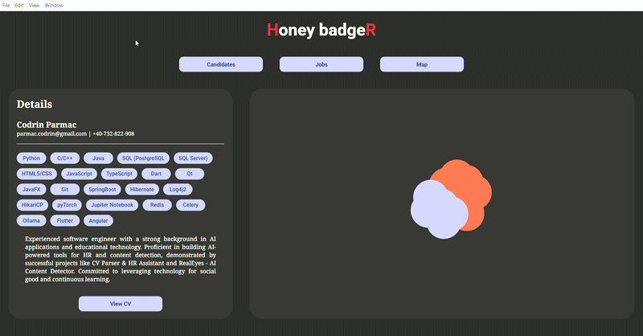

# Project Index
AI-powered CV parsing and HR assistant platform.

This project is designed to streamline the recruitment process by leveraging advanced AI techniques to parse CVs, extract relevant information, and provide recommendations for candidate-job matching. To be totally impartial, the system uses a combination of exact matches and semantic similarity to evaluate candidates against job requirements.

This project was developed for educational purposes and is not intended for commercial use. The scoring system is more then anything but good, and it should be treated as a proof of concept.

### Architecture
- [Architecture Overview](docs/cv-parser-architecture.md)

### Development
- [Project Plan](docs/cv-parser-plan.md)

### Development Guidelines
- [TEAM, READ THIS!](docs/how-to-code.md)

### App Overview
This overview shows the look of the app and the main three features: candidate scoring and parsing, job insertion and matching, and UMAP visualization (that doesn't work that well).

